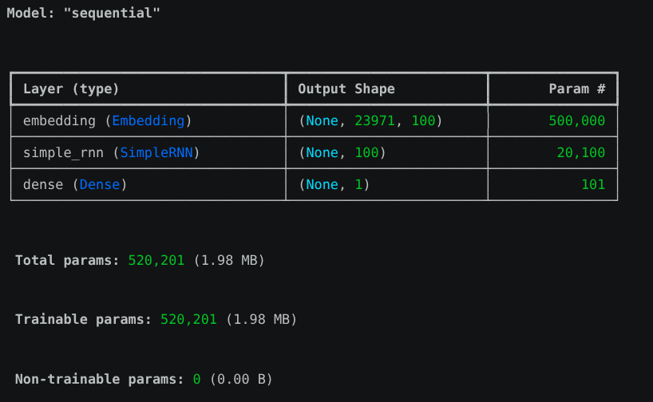
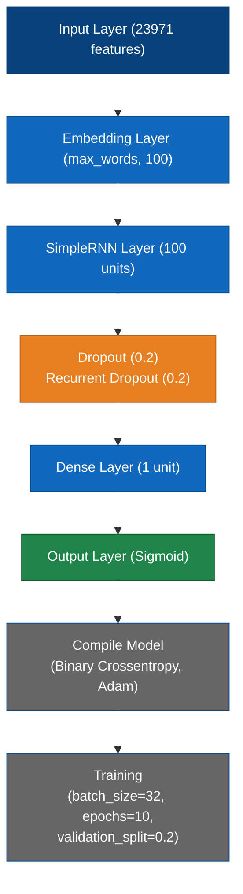

# Twitter Hate Speech Classifier: An Automated NLP Pipeline

## Problem Statement
Detecting hate speech at scale is a critical challenge for social media platforms. This project addresses the need for automated moderation by creating a Deep learning pipeline that accurately distinguishes between hate and neutral speech in real-time tweet data
<br>
Input: Text<br>
Output: Hate / Not Hate<br>

## Data Preprocessing Steps
- Load the dataset
- Clean the text/data
    * Converting all text to lowercase
- Remove unnecessary symbols or null values
    * Removing bracketed text [...]
    * Removing URLs (http, https, www)
    * Removing HTML tags <...>
    * Removing punctuation using string.punctuation
    * Removing newlines \n and specific characters like @, ur..., and ð...
    * Removing extra whitespaces.
    * Removing alphanumeric tokens containing digits 
    * Stopwords Removal
    * Stemming [nltk.SnowballStemmer]
- Tokenize or normalize the input
- Split into train, validation, and test sets
- Convert data into model-ready format

## Vocabulary Creation Approach
* Tokenization: Splitting the cleaned tweets into individual tokens
    ```bash 
    all_words=[]
    for i in df['tweet']:
        for j in i.split():
            all_words.append(j)
* Vocabulary Size: 38,616 words.

## Model Architecture




## Training Details
- Loss function:Binary Crossentropy
- Optimizer:Adam
- Number of epochs:10
- Hardware used:Nvidia-2050 [cuda Version-13.0]
- Evaluation metric:accuracy

## Final Results (Accuracy)
- Training Accuracy:0.9617
- Validation Accuracy:0.9328
- Test Accuracy:0.9399 

## Steps to Run

1. **Clone** the project
   ```bash 
   git clone https://github.com/hemanthreddyyanamala/neural_networks/tree/main/NLP_MINI_PROJ

2. **Create** virtual environment
   ```bash
   python3 -m venv .venv
3. **activate** venv:
   ```bash
   .venv/Scripts/activate #windows
   source .venv/bin/activate # linux/mac
4. **Install dependencies/requirements**:
   ```bash
   pip install NLP_MINI_PROJ/requirements.txt

5. **Run the app:**

   ```bash
   streamlit run NLP_MINI_PROJ/app.py

**Open http://localhost:8501 in your browser**